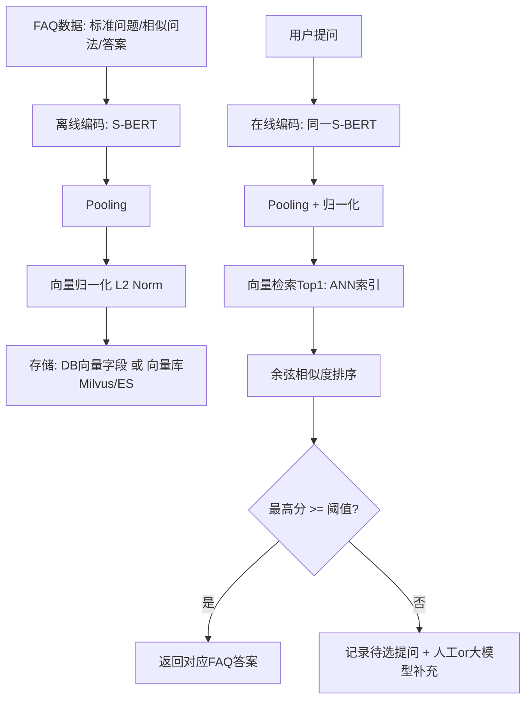

# HW2
- 我们的目标是：把FAQ里的有答案的“历史问题”先用S-BERT编码成句向量，用户新提出的“相似问题”也编码成向量，然后做相似度检索，找到最像的那个问题并返回该题目对应的答案。
- 流程分两部分：
  1. 离线建库（预处理）：
  把所有FAQ问题（包含标准问题+相似问法）输入S-BERT，得到向量表示。向量进行归一化（L2 norm），然后存入数据库（vector字段）或向量库（Milvus/ES向量检索），并保存问题ID与答案ID的映射关系。
  2. 在线检索（用户提问）：
  用户输入问题后，同样用同一个模型编码成向量，并进行归一化；接着用余弦相似度计算与库中向量的相似度：
  cos = (A·B) / (|A||B|) 从中取Top1最相似的问题。如果最高分超过阈值（例如0.85），返回对应答案；否则进入“未命中”，记录到待选提问，供人工或者大语言模型介入补充FAQ。

