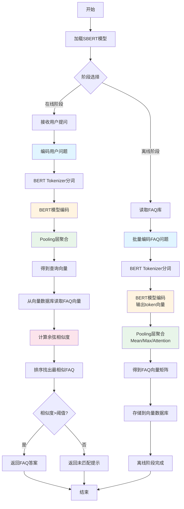

# 作业2：基于BERT的文本编码与相似度计算技术方案

## 一、技术方案概述

本方案使用SBERT（Sentence-BERT）架构，基于BERT进行文本编码，通过向量相似度实现FAQ匹配。核心流程包括：BERT编码、Pooling降维、向量存储、相似度计算。

## 二、BERT文本编码流程

**步骤1：文本预处理**
- 使用BERT分词器（Tokenizer）将输入文本转换为token序列
- 添加特殊token：`[CLS]`（句首）和`[SEP]`（句尾）
- 输出：`input_ids`、`attention_mask`、`token_type_ids`

**步骤2：BERT编码**
- 将token序列输入BERT模型，经过Transformer编码
- BERT输出每个token的隐藏状态：`last_hidden_state`

**步骤3：Pooling降维**
- 将token级别的向量聚合为句子级别的向量
- 常用方法：
  - **Mean Pooling**：对有效token的向量求平均
  - **Max Pooling**：取每个维度的最大值
  - **Attention Pooling**：使用注意力机制加权求和
- 输出：句子向量（shape: batch_size × 768）

## 三、相似度计算方案

**离线阶段（FAQ库编码）**
1. 加载SBERT模型
2. 批量编码所有FAQ问题，得到FAQ向量矩阵
3. 存储到向量数据库

**在线阶段（用户查询）**
1. 用户提问输入
2. 使用相同SBERT模型编码用户问题，得到查询向量
3. 计算查询向量与FAQ向量库的余弦相似度：
   ```
   similarity = cosine(query_vector, faq_vectors) = dot(query, faq) / (||query|| × ||faq||)
   ```
4. 返回相似度最高的FAQ对应的答案

## 四、技术实现要点

- **模型选择**：使用预训练的SBERT模型，已包含BERT编码层和Pooling层
- **批量处理**：FAQ库编码采用批量处理，提升效率
- **向量归一化**：对编码后的向量进行L2归一化，简化余弦相似度计算
- **阈值设置**：设置相似度阈值，低于阈值返回"未匹配"

---

## 流程图


---

