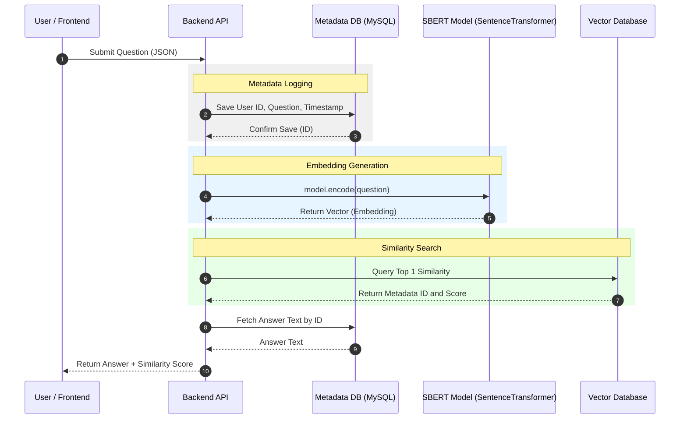

## 智能客服工作台项目

### 技术方案：基于 SBERT 的语义相似度检索系统

采用 Sentence-BERT (SBERT) 作为核心模型。 通过孪生网络结构预训练，将任意长度的句子映射为一个固定维度向量，接通过计算向量间的几何距离来衡量语义相似度。

使用预训练模型BERT 模型（google-bert/bert-base-chinese）。对于输入的每一个句子 $S$，模型输出一个 $d$ 维向量 $\mathbf{v}$。

系统检索时，通过计算用户提问向量 $\mathbf{u}$ 与库中候选向量 $\mathbf{v}$ 的余弦相似度 (Cosine Similarity) 来评估相关性：

$$\text{similarity} = \cos(\theta) = \frac{\mathbf{u} \cdot \mathbf{v}}{\|\mathbf{u}\| \|\mathbf{v}\|}$$

该值越接近 1，表示两个问题的语义越一致。

