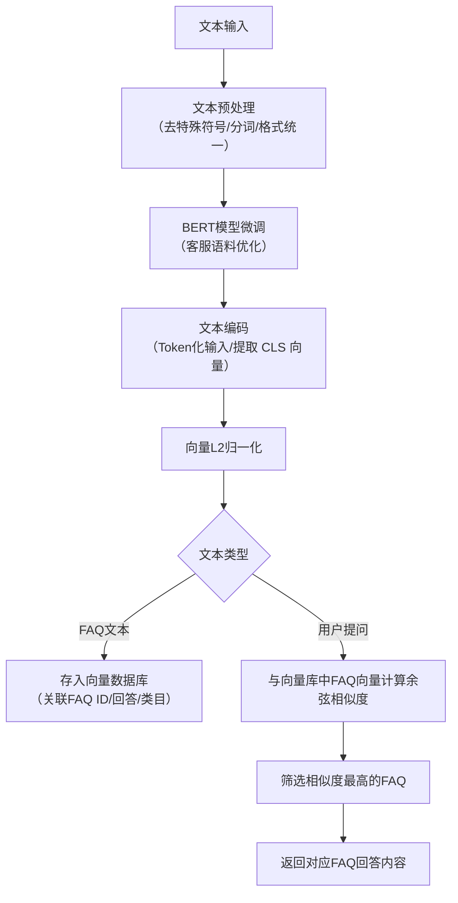

# 基于BERT的文本编码与相似度计算技术方案

## 一、核心技术方案
针对客服工作台用户提问与FAQ文本的相似度匹配需求，基于BERT模型的文本编码与相似度计算技术方案核心逻辑为：将非结构化的文本转化为结构化的语义向量，通过向量相似度计算实现文本语义层面的匹配，具体实施步骤如下：

### 1. 模型预处理与微调

首先选取中文轻量版BERT模型（如BERT-base-chinese）作为基础模型，基于客服工作台的业务语料（包含一级/二级类目下的FAQ标准问法、相似问法、历史用户提问）进行微调，适配客服领域的语义特征。微调数据集需完成标注（将同一FAQ的标准问法与相似问法标注为同一类别），通过分类任务优化模型的语义表征能力，确保模型能精准捕捉客服场景下的文本语义。

### 2. 文本编码流程

（1）文本预处理：对用户提问、FAQ文本进行统一清洗，包括去除特殊符号、统一文本格式、分词（基于BERT自带的分词器），并按照BERT输入要求转换为Token ID、Segment ID、Attention Mask；
（2）语义向量生成：将预处理后的文本输入微调后的BERT模型，提取模型[CLS]位置的输出向量作为文本的语义编码向量（维度为768维），该向量可精准表征文本的语义信息；
（3）向量归一化：对生成的语义向量进行L2归一化处理，消除向量长度对后续相似度计算的影响，保证计算结果的公平性。

### 3. 相似度计算逻辑

（1）离线预处理：提前将所有生效状态的FAQ文本（含标准问法、相似问法）完成编码与归一化，存储至向量数据库（如Milvus），并关联对应的FAQ ID、回答内容、类目信息；
（2）实时匹配：用户提问经编码与归一化后，与向量数据库中的FAQ向量进行余弦相似度计算，公式为：$相似度 = \frac{向量A·向量B}{||向量A||×||向量B||}$；
（3）结果筛选：设定相似度阈值（如0.8），筛选出阈值以上的FAQ向量，取相似度最高的条目，返回其关联的FAQ回答内容。

## 二、流程图

